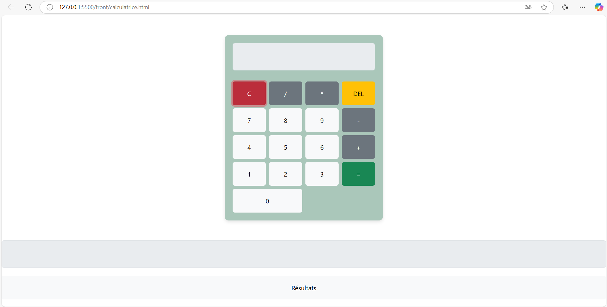

# 🌐 Application Cloud Native Calculator

Ce répertoire contient les différents composants de l'application Cloud Native Calculator, répartis entre le **Consumer**, le **Backend**, et le **Frontend**. Chacun de ces composants est accompagné de son propre fichier `Dockerfile` pour faciliter son déploiement.

## 🗂️ Structure du Répertoire

- **Consumer** : Gère la consommation des messages de la file RabbitMQ.
  - `consumer.py` : Script principal du Consumer.
  - `Dockerfile` : Définit l'image Docker du Consumer.

- **Backend** : Fournit les API pour effectuer les calculs.
  - `api.py` : Script principal de l'API backend.
  - `Dockerfile` : Définit l'image Docker du Backend.

- **Frontend** : Offre une interface utilisateur pour entrer les calculs et afficher les résultats.
  - `calculatrice.html` : Fichier HTML de la page d'accueil.
  - `nginx.conf` : Configuration de Nginx pour servir l'application.
  - `Dockerfile` : Définit l'image Docker pour le serveur Nginx.

---

## 🚀 Instructions de Déploiement

> **Prérequis**
- Docker doit être installé sur votre machine.

### Étapes de Déploiement
1. **Consumer** :
   - Naviguez dans le répertoire `application/Consumer`.
   - Construisez l'image Docker :
     ```bash
     docker build -t consumer .
     ```
   - Exécutez le conteneur :
     ```bash
     docker run --rm -d --name consumer-app consumer
     ```

2. **Backend** :
   - Naviguez dans le répertoire `application/back`.
   - Construisez l'image Docker :
     ```bash
     docker build -t backend .
     ```
   - Exécutez le conteneur :
     ```bash
     docker run --rm -d -p 5000:5000 --name backend-app backend
     ```

3. **Frontend** :
   - Naviguez dans le répertoire `application/front`.
   - Construisez l'image Docker :
     ```bash
     docker build -t frontend .
     ```
   - Exécutez le conteneur :
     ```bash
     docker run --rm -d -p 8080:80 --name frontend-app frontend
     ```

---

## 🌟 Fonctionnalités des Composants

### Consumer
- Consomme les messages provenant de la file RabbitMQ.
- Traite les calculs et renvoie les résultats au Backend.

### Backend
- Fournit les API REST pour les opérations mathématiques de base :
  - Addition
  - Soustraction
  - Multiplication
  - Division
- Communication avec RabbitMQ pour déléguer certaines tâches.

### Frontend
- Interface utilisateur simple et intuitive.
- Permet de saisir des opérations mathématiques.
- Affiche les résultats directement dans le navigateur.

---

## 📸 Capture d'écran
Voici une capture d'écran de l'interface utilisateur de la calculatrice :



---

Merci d'utiliser notre application ! 😊
